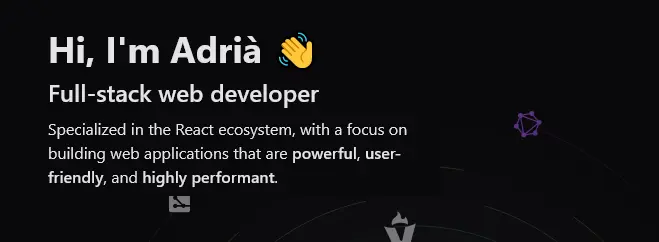
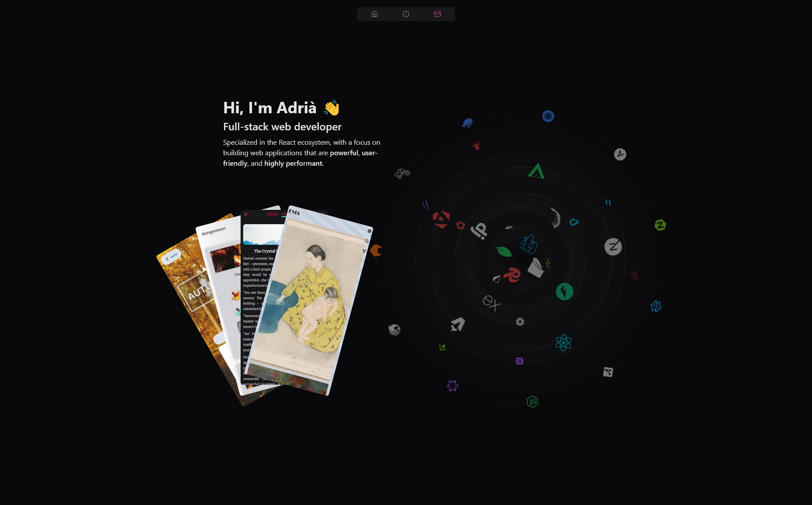

<div align="center" id="readme-top">
  <a href="https://github.com/gomisroca/portfolio">
    
  </a>

<h3 align="center">Portfolio</h3>

  <p align="center">
    A portfolio of my projects as well as general information about me, what I'm working on and my interests.
    <br />
    <a href="https://github.com/gomisroca/portfolio"><strong>Explore the docs »</strong></a>
    <br />
    <br />
    <a href="https://gomisroca.github.io/portfolio/">View Demo</a>
    ·
    <a href="https://github.com/gomisroca/portfolio/issues/new?labels=bug&template=bug-report---.md">Report Bug</a>
    ·
    <a href="https://github.com/gomisroca/portfolio/issues/new?labels=enhancement&template=feature-request---.md">Request Feature</a>
  </p>
</div>

<!-- TABLE OF CONTENTS -->
<details>
  <summary>Table of Contents</summary>
  <ol>
    <li>
      <a href="#about-the-project">About The Project</a>
      <ul>
        <li><a href="#built-with">Built With</a></li>
      </ul>
    </li>
    <li>
      <a href="#getting-started">Getting Started</a>
      <ul>
        <li><a href="#prerequisites">Prerequisites</a></li>
        <li><a href="#installation">Installation</a></li>
      </ul>
    </li>
    <li><a href="#usage">Usage</a></li>
    <li>
      <a href="#adjustments">Adjusting the Codebase</a>
      <ul>
        <li><a href="#hardcoded-data">Hardcoded Data</a></li>
      </ul>
    </li>
    <li><a href="#roadmap">Roadmap</a></li>
    <li><a href="#license">License</a></li>
    <li><a href="#contact">Contact</a></li>
  </ol>
</details>

<!-- ABOUT THE PROJECT -->
<h2 id="about-the-project">📡 About The Project</h2>



The project is a web application that showcases my portfolio of projects, as well as information about me, my work and what I'm currently learning.  
Note certain details have been hardcoded, but they should be easily replaced. More details [here](#adjusting-the-codebase).

### Built With


<p align="right">[<a href="#readme-top">back to top</a>]</p>

<!-- GETTING STARTED -->
<h2 id="getting-started">📋 Getting Started</h2>

Follow these steps to get your own local copy of the project up and running.

<h3 id="prerequisites">Prerequisites</h3>

Make sure you have node.js and npm installed on your machine.

- npm
  ```sh
  npm install npm@latest -g
  ```
  Beyond this, if you plan on adjusting the codebase, you might need some knowledge of Astro, React or Motion depending on the changes you plan on making.

<h3 id="installation">Installation</h3>

1. Clone the repo
   ```sh
   git clone https://github.com/gomisroca/portfolio.git
   ```
2. Install NPM packages
   ```sh
   npm install
   ```
3. Change git remote url to avoid accidental pushes to base project
   ```sh
   git remote set-url origin github_username/repo_name
   git remote -v # confirm the changes
   ```

<p align="right">[<a href="#readme-top">back to top</a>]</p>

<!-- USAGE EXAMPLES -->
<h2 id="usage">💠 Usage</h2>

You can run the project in development mode from the main folder with **npm run dev**.

This project makes extensive use of Astro's [i18n features](https://docs.astro.build/en/recipes/i18n/) and [Content Collections](https://docs.astro.build/en/guides/content-collections/), as well as [Island Architecture](https://docs.astro.build/en/concepts/islands/) to add React snippets. Likewise, parts of this project, in particular those related to the landing page, make extensive use of [Motion](https://motion.dev/).

<p align="right">[<a href="#readme-top">back to top</a>]</p>

<!-- ADJUSTMENTS -->
<h2 id="adjustments">🔨 Adjusting the Codebase</h2>

  <h3 id="hardcoded-data">📑 Hardcoded Data</h3>

By default, the project uses a certain amount of hardcoded data, mainly in the 'contact' and 'about' sections, and in the Content Collections, as well as in assets such as the avatar. If you wish to adapt this data to your needs, a good first step is to search the project folder for _gomisroca_ (my github name) and changing those instances. While this won't cover all instances, it should get rid of most of them.

These hardcoded instances will be replaced with environment variables in a future update to facilitate this process.

<p align="right">[<a href="#readme-top">back to top</a>]</p>

<!-- ROADMAP -->
<h2 id="roadmap">📍 Roadmap</h2>

- [ ] Replace hardcoded data with environment variables.

See the [open issues](https://github.com/gomisroca/portfolio/issues) for a full list of proposed features (and known issues).

<p align="right">[<a href="#readme-top">back to top</a>]</p>

<!-- LICENSE -->
<h2 id="license">🔒 License</h2>

Distributed under the MIT License. See `LICENSE.txt` for more information.

<!-- CONTACT -->
<h2 id="contact">📧 Contact</h2>

Adrià Gomis - [@gomisroca](https://github.com/gomisroca) - gomisroca@gmail.com

<p align="right">[<a href="#readme-top">back to top</a>]</p>
